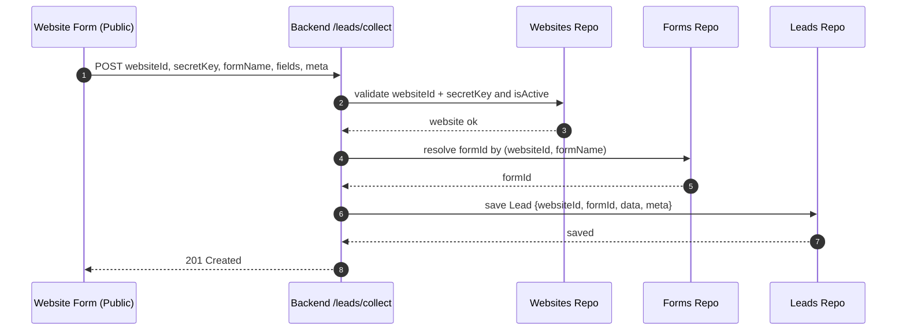

# Lead Management Application – Architecture

## Overview

This project is a full‑stack lead management system that lets users register/login, configure websites and forms, and collect/query/manage leads.

- **Frontend**: React + React Router, Context for auth/theme, Axios + React Query for API, Tailwind/shadcn UI.
- **Backend**: NestJS (modules: Auth, Websites, Leads, Database), TypeORM entities, DTO validation, guards, Swagger decorators.
- **Storage**: Relational DB via TypeORM (entities: Users, Websites, WebsiteForms, Leads). Leads store flexible `jsonb` data and optional `meta`.
- **Auth**: JWT-based with access and refresh tokens; admin guard for protected routes.
- **Lead capture**: Two paths
  - Public ingestion using a per‑website `secretKey` at `POST /leads/collect`
  - Authenticated dashboard create/update/query/delete under `/leads` (requires JWT)

## High-level Architecture

```mermaid
flowchart LR
  subgraph UserDevice[User Browser]
    UI[React SPA]
  end

  subgraph Frontend[Frontend]
    RRT[React Router]
    Ctx[Auth/Theme Context]
    RQ[React Query Hooks\nuseApi/useLeads]
    API[Axios apiClient]
    UI --> RRT --> Ctx
    Ctx --> RQ --> API
  end

  subgraph Backend[NestJS Backend]
    AM[Auth Module]
    WM[Websites Module]
    LM[Leads Module]
    DBM[Database Modules]
    API --> AM & WM & LM
  end

  subgraph DB[(Database)]
    U[Users]
    W[Websites]
    F[WebsiteForms]
    L[Leads\njsonb data/meta]
  end

  LM --> L
  WM --> W & F
  AM --> U
  DBM --- DB

  extForm[Website Form\n(public)] -- POST /leads/collect + secretKey --> LM
```

## Frontend

- **Routing** (`frontend/src/App.tsx`)
  - Public: `/login`, `/register`
  - Protected (via `ProtectedRoute` + `ProtectedLayout`): `/` (Dashboard), `/websites`, `/websites/:id`, `/detect-forms`, `/profile`
- **State/Access**
  - `AuthContext` provides `isAuthenticated` for route guards
  - `ThemeContext` for theming
  - Data fetching/mutations via React Query wrappers in `useApi.ts`
- **Leads hooks** (`frontend/src/hooks/useLeads.ts`)
  - `useLeads` GET `/leads` with filters/pagination
  - `useLead` GET `/leads/:id`
  - `useCreateLead` POST `/leads`
  - `useUpdateLead` PUT `/leads/:id`
  - `useDeleteLead` DELETE `/leads/:id`
- **Dashboard** (`frontend/src/pages/Dashboard.tsx`)
  - Displays static analytics placeholders; wire up to `/leads` for live data when needed

## Backend

- **App module** (`backend/src/app.module.ts`): imports `DatabaseModule`, `DatabaseEntityModule`, `AuthModule`, `WebsitesModule`, `LeadsModule`.
- **Leads module**
  - Entity: `LeadsEntity` (websiteId, formId, data: jsonb, meta: jsonb?)
  - DTOs: `CreateLeadDto`, `UpdateLeadDto`, `LeadsQueryDto`, `DeleteManyLeadsDto`
  - Controller: `LeadsController`
    - Public: `POST /leads/collect` (requires valid websiteId + secretKey)
    - Protected (AdminAuthGuard): `POST /leads`, `GET /leads`, `GET /leads/:id`, `PUT /leads/:id`, `DELETE /leads`
  - Service: `LeadsService`
    - Validates website ownership/active status
    - Resolves `formId` by `formName`
    - Creates, queries with pagination/sorting/search over `data` fields, updates, and batch deletes
- **Auth module**
  - `AuthService` issues JWT access (1h) and refresh (7d) tokens; SHA‑256 password hashing
  - `AdminAuthGuard` protects dashboard endpoints
- **Websites module**
  - Entities: `WebsitesEntity`, `WebsiteFormsEntity` (used to bind leads to specific forms)
- **Database/config**
  - TypeORM entities extend a shared `BaseEntity` with KSUID IDs
  - Config (`backend/src/config/app.config.ts`) includes `PORT`, `ENVIRONMENT`, `ALLOWED_ORIGINS`, `SENTRY_DSN`, `X_API_KEY`

## Data Model (core)

- **UsersEntity**: `id`, `name`, `email (unique)`, `password`
- **WebsitesEntity**: `id`, `secretKey`, `secretKeyExpiresAt`, `isActive`, `createdBy`
- **WebsiteFormsEntity**: `id`, `websiteId`, `name`
- **LeadsEntity**: `id`, `websiteId`, `formId`, `data: jsonb`, `meta?: jsonb`, audit fields

## API Summary (Leads)

- Public ingestion
  - `POST /leads/collect` body: `{ websiteId, secretKey, formName, fields, meta? }`
- Authenticated (JWT)
  - `POST /leads` body: `{ websiteId, formName, fields, meta? }`
  - `GET /leads` query: `page, limit, sort, order, search, field, websiteId, formId, isPagination`
  - `GET /leads/:id`
  - `PUT /leads/:id` body: partial of create DTO
  - `DELETE /leads` body: `{ ids: string[] }`

## Lead Ingestion Sequence



## Security & Access

- JWT auth for all dashboard endpoints via `AdminAuthGuard`.
- Public form ingestion requires valid `secretKey` and non‑expired `secretKeyExpiresAt` for the website.
- CORS origins configured via `ALLOWED_ORIGINS`.

## Environment & Deployment

- Backend reads `ENVIRONMENT`, `PORT`, `ALLOWED_ORIGINS`, `SENTRY_DSN`, `X_API_KEY` (if used by middleware/guards).
- Frontend expects a base API URL configured in the Axios `apiClient` (see `frontend/src/lib/apiClient`).

## Extensibility

- Add automations (email/webhook/CRM) by subscribing in `LeadsService.create/collect`.
- Extend search by indexing more `data` fields or adding filters.
- Wire the Dashboard to live analytics by aggregating `/leads` responses.
